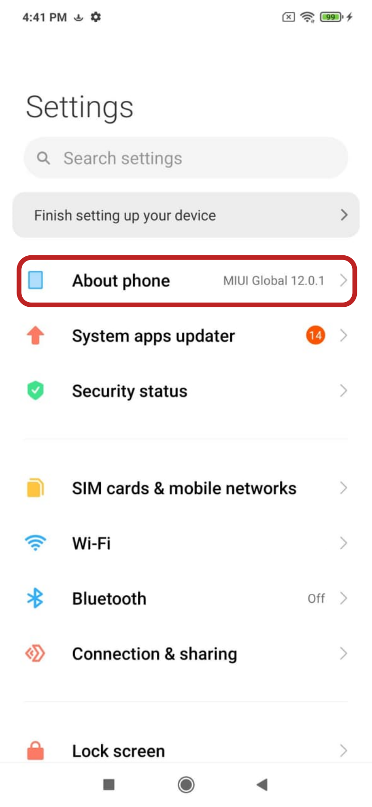
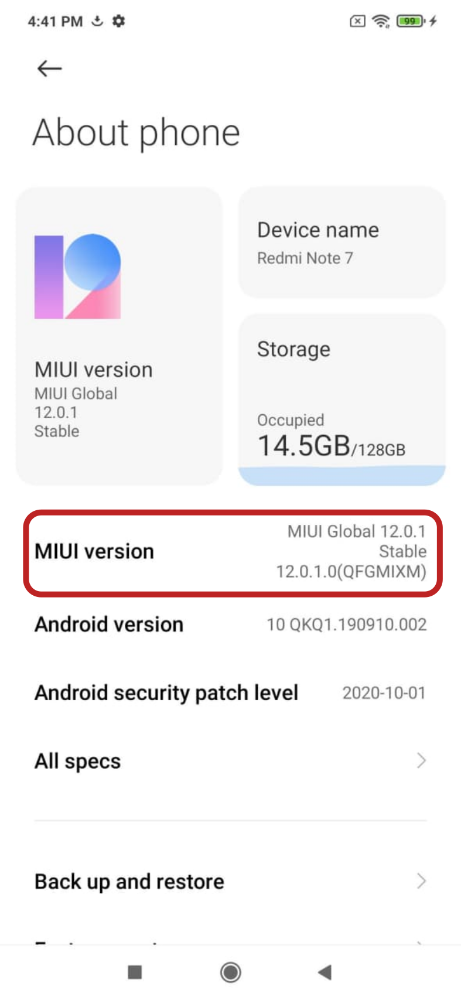
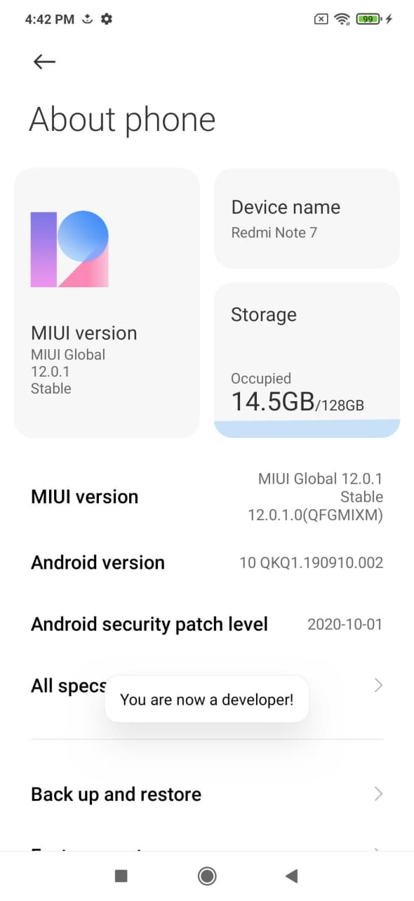
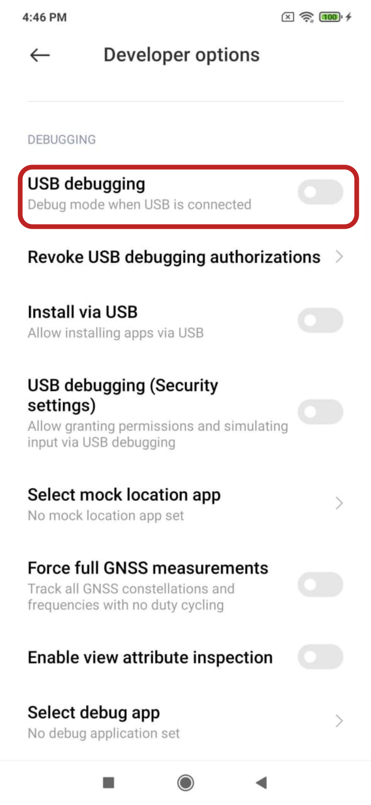
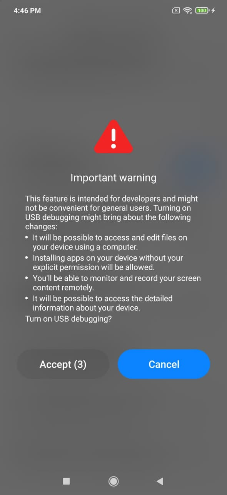
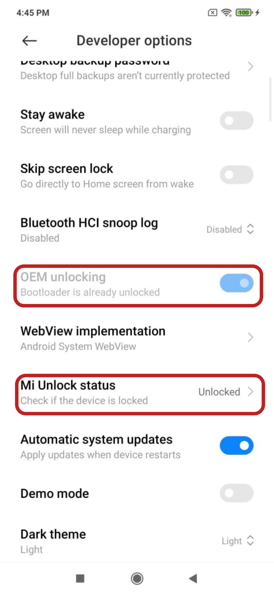

# Xiaomi Redmi Note 7 Installation Guide for Ubuntu Touch

Guide by Dr.Hax, follow me on [GitHub](https://github.com/MrDrHax)

## 1) Getting everything ready

For this guide to help you, you have to have the following handy:

1. a Xiaomi Redmi Note 7
2. a pc with windows installed on it (wine might work, but it is untested)
3. USB-a to USB-c with data transfer capabilities

Before you start the installation process, make sure you have the following also installed:

- The phone has to be updated to it's latest firmware version (check on settings, updates)
- Mi Unlock (the individual works better than the bulk) found in: https://en.miui.com/unlock/download_en.html or if you can't find the individual, [this form](https://c.mi.com/thread-2262302-1-0.html) has all the FAQ, as well as many download links. (I ended up using that one)
- A Xiaomi Mi account
- The ub ports installer (can be windows, mac or Linux) found [here](https://devices.ubuntu-touch.io/installer/)

### Things to consider before starting processes:
Doing an OEM unlock will bind he phone to your account, as well as deactivate many other features such as find my phone, and other things xiaomi considers "More secure" features.

It is 1000% recommended to make a backup of the device. If anything fails during the installation, it will be your only savior, so just make it. *Pretty please?*

    I have been using Ubuntu Touch for more than a month now, and it honestly is mature enough to be a daily driver. Just not for Everyone. The lack of many apps (specially banking and social), and the way everyone assumes that the only existing OS's are Android and iOS makes it a bit difficult for a lot of people. But messaging (SMS), camera, music, calls, and some other apps such as 2fa and telegram have worked great, and if you think that not having some features, but having some others if for you, then I do recommend it a lot! (the fact that it can run any .deb thing is amazing tho you do need a dongle to plug everything in and use them, using it on suck a small screen sucks)

> Finally, this guide is just that, you are responsible for everything you do, and while I don't think you will get the device bricked, it still is a possibility, so just keep that in mind, we will not be responsible for that, and make sure you practice the common sense when downloading things from the internet. If you decide to continue, Good luck, and be patient! If you get stuck during the installation, you can find very nice people and help on the telegram chat

## 2) OEM unlock

To start the OEM unlock processes, you need to **sign in on the device to your personal Xiaomi Mi account**, you can do this under settings.

**Enable developer mode**: to do this, go to settings > about phone, and tap the hell out of the `"MUI version"` label (even if not a button). after 3 taps, you will get a notification that tells you to keep tapping to enter developer mode. After that, it will start to make a countdown to tell you how many more taps you need until you become a developer, and finally, it will give you a "you are now a developer" notification. If you keep tapping, it will just tell you you're already a developer.

Perfect, if you go back to settings list, there should now be a developer tab under the extra settings, enter it for next steps.

**Enable USB debugging**: under developer tools, search for a `USB debugging` option. Turn it on, a prompt that asks if you are sure about this will appear, click on yes, enable. 

##### NOTE: If you are traveling, or connecting to not trusted pc's, DO NOT enable this feature, it will leave your phone vulnerable to data leaks.

**Enable OEM Unlock**: Under the same developer tools tab, you will be able to see a `OEM Unlucking` checkbox, activate it. If prompted with a enable, click on accept.

Once you click on it, a new option will appear: `Mi Unlock Status`

##### Note: this phone was already unlocked, but the same options should be available to you

**Get device ready for unlock**: under the Mi Unlock Status tab, you should see a big padlock telling you device is secured, so we are going to do the most secure thing ever and ignore that and click the button on the bottom: *"Add account and device"*.

This will pair your account and the device together for OEM unlock. you should see a success notification, if you do, that means you're ready for the next step, if it somehow fails, you need to check another guide to unlock it.

**Booting into FastBoot** Now that you are registered, turn off you're phone completely. Once off, click the volume down and power button until it boots into a bunny fixing an android bot. 

Open your PC (running windows), and open the Xiaomi Mi Unlock tool

Log into your account, and go into the settings, there find the install necessary drivers option and it will prompt you to connect the device, connect it, and it should handle the drivers installation automatically.

**Finally, finish the unlock** Once the drivers and all are connected, you should see your phone, and a unlock button in green.

Click it, do it! I dare you. No, I double dare you!

You will be prompted with a are you sure thingy, and a cooldown to make sure you read the stuff, so I guess read it until you can click the yes? Either way, if successful, your phone will start the OEM unlock process, and you will be *probably* happy. Let it be for a few minutes, and after that, it will again reboot, this time, the boot screen will have an unlocked lock icon at the top, if it does, congrats!, you just did the most difficult part. 

Finally, it will ask you to do the setup again, so just do it, and go into settings.

Make the same become a developer enable USB debugging, and enter the `Mi Unlock Status` part. Once there, you should see the device is unlocked, this is just to be assured it is, and to make sure that everything is working as expected.

I couldn't get any images of this, however, here is a YouTube video: https://youtu.be/2mN64Gl70dQ?t=245 (not in english, but you can follow through)

## 3) Start installation of Ubuntu touch

You made it this far! be proud of yourself, you are a hacker now (kinda, I think).

**Select the device** Connect your device to your pc again (can be Windows, Mac, or Linux), and your phone should ask you what do you want to do with this device? Tell it to transmit data.

Open the UB ports installer. Your device should be recognized automatically, and the installer should guide you through the following steps, but here is a little help from me.

1. Do not get rid of android unless you are completely sure you want to or have a backup. I had a lot of second thoughts about my installation, and since I didn't backup mu "stock" android version, I had to get a shady android version from another site. So I decided to just stick with Ubuntu touch.
1. When asked to download a new file for copyright reasons, you need to unpack it first, then select the select the extracted.
1. if you get stuck on the first step for more than a minute, you did something wrong, go to the UB ports telegram for help.

**Boot into Ubuntu Touch**: Perfect, you did it! Now go through the setup processes, give your device a name, and all of that good stuff. An you are now done! 

## 4) So now what?

Starting to use Ubuntu Touch can be a bit weird, it is nothing like android or iOS, so it will take a little to get used to.

Here are some of my findings as well:

Go into settings > security and privacy to add your finger to unlock the device.

Do not touch the fingerprint device because it considers it as a keyboard ENTER type, so keep that in mind, also the fingerprint device might get stuck, just give it a tap, and it should solve most of screen glitchy-ness problems. (like not letting you open the apps screen, or when closing apps)

The OpenStore has some great apps such as FluffyChat (matrix), TELEports (telegram), uNAV (maps), and UT Tweak Tool (customization tool) that you should have. 

Ubuntu touch has a nice way to install desktop apps, go to settings > Libertine, and create a new container. Unless you know what you are doing, I recommend downloading apps from there, make sure the container setup is finished before doing anything tho, since it might make problems if not.

Go nuts with the desktop apps, although they might not all work.

If you want Anbox, and other cool stuff, you can change the channel where you are making updates from. By default you will be on "Stable", but navigate to settings > updates, and on the top right you should see a gear thingy, from there you can change the Channel to download updates from.

To activate anbox, go into the terminal and write: `anbox-tool install` let it load, and you'll be on your way.

Finally, google accounts sync does not work (ik, but blame google for banning it)

As an additional note: most apps have a feature to bring up an extra menu if you swipe from the bottom up. This is where alarms are in the clock app (took me ages to find that).

